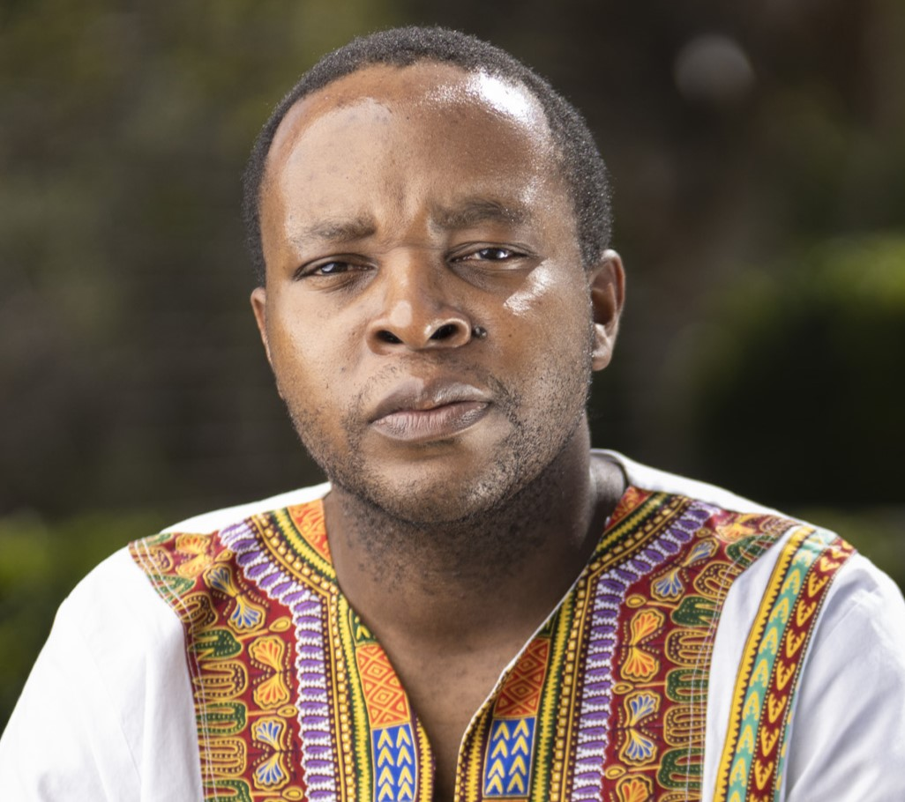
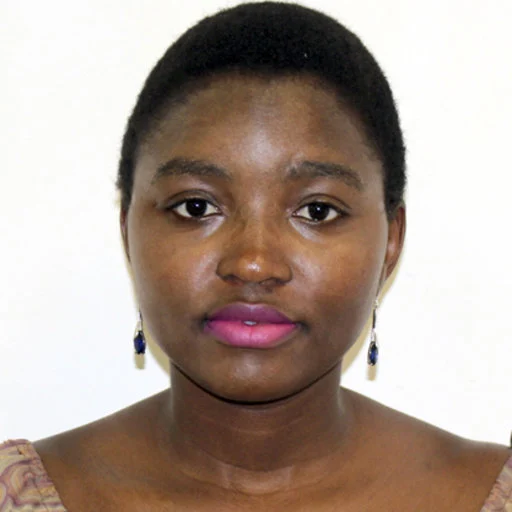
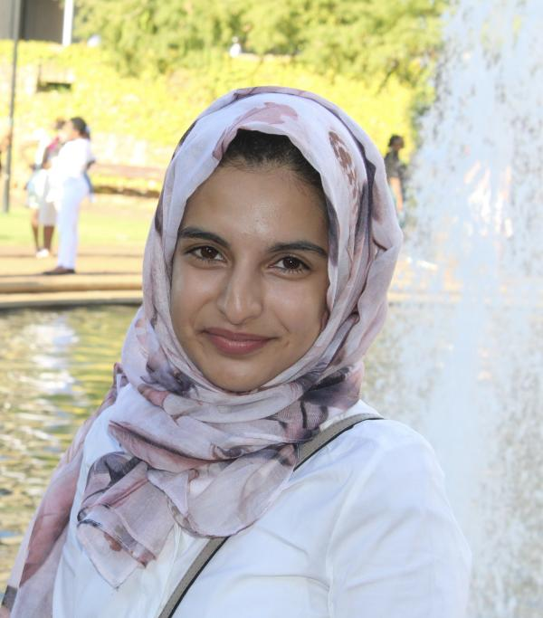
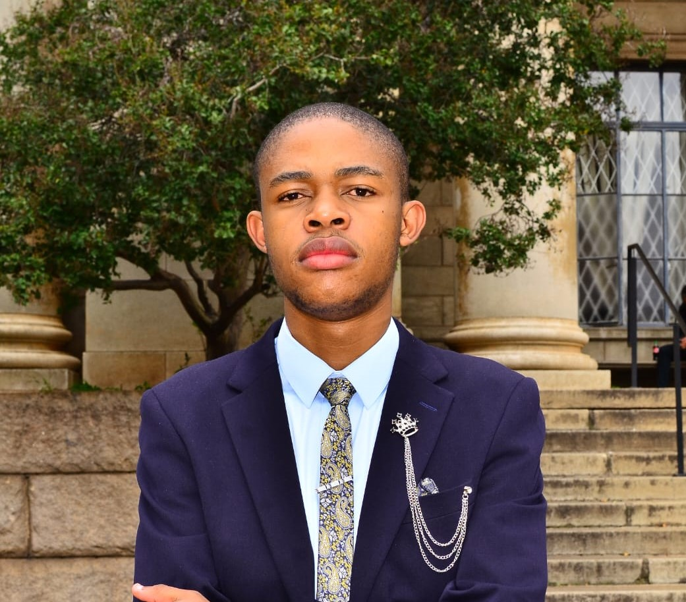
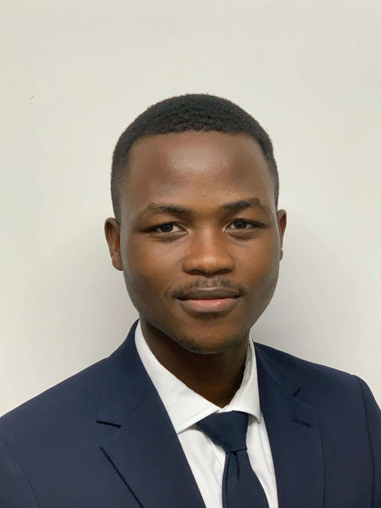

```{=html}
<style>
/* Team grid layout */
.team-grid {
  display: grid;
  grid-template-columns: repeat(auto-fit, minmax(300px, 1fr));
  gap: 2rem;
  max-width: 1200px;
  margin: 0 auto;
  padding: 0 1rem;
}

/* Individual team card (closed state) */
.team-card-compact {
  background: white;
  border-radius: 16px;
  padding: 2rem;
  text-align: center;
  cursor: pointer;
  transition: all 0.4s cubic-bezier(0.4, 0, 0.2, 1);
  border: 1px solid #eee;
  position: relative;
  overflow: hidden;
}

.team-card-compact:hover {
  transform: translateY(-8px);
  box-shadow: 0 20px 40px rgba(0, 43, 92, 0.15);
}

/* Photo styling */
.team-photo {
  width: 120px;
  height: 120px;
  border-radius: 50%;
  object-fit: cover;
  margin: 0 auto 1.5rem;
  border: 4px solid var(--color-gold);
  transition: all 0.4s ease;
}

/* Name and role */
.team-name-compact {
  font-size: 1.25rem;
  font-weight: 700;
  color: var(--color-navy);
  margin-bottom: 0.5rem;
}

.team-role-compact {
  font-size: 0.9rem;
  color: var(--color-gold-dark);
  font-weight: 600;
  margin-bottom: 1rem;
}

/* Badges container */
.team-badges-compact {
  display: flex;
  flex-wrap: wrap;
  justify-content: center;
  gap: 0.5rem;
  margin-top: 1rem;
}

/* Expanded bio panel (hidden by default) */
.team-bio-full {
  max-height: 0;
  overflow: hidden;
  opacity: 0;
  transition: all 0.6s cubic-bezier(0.4, 0, 0.2, 1);
  margin-top: 0;
  padding: 0 2rem;
}

/* Active/expanded state */
.team-card-compact.active {
  position: fixed;
  top: 50%;
  left: 50%;
  transform: translate(-50%, -50%);
  width: 90%;
  max-width: 900px;
  max-height: 90vh;
  overflow-y: auto;
  z-index: 1000;
  box-shadow: 0 25px 50px rgba(0, 0, 0, 0.25);
}

.team-card-compact.active .team-photo {
  width: 100px;
  height: 100px;
  margin-top: 1rem;
}

.team-card-compact.active .team-bio-full {
  max-height: 2000px;
  opacity: 1;
  margin-top: 2rem;
  padding: 2rem;
  background: #f8f9fa;
  border-radius: 12px;
}

/* Overlay when card is active */
.overlay {
  position: fixed;
  top: 0;
  left: 0;
  width: 100%;
  height: 100%;
  background: rgba(0, 43, 92, 0.8);
  opacity: 0;
  visibility: hidden;
  transition: all 0.3s ease;
  z-index: 999;
}

.overlay.active {
  opacity: 1;
  visibility: visible;
}

/* Close button */
.close-btn {
  position: absolute;
  top: 1.5rem;
  right: 1rem;
  width: 40px;
  height: 40px;
  border-radius: 50%;
  background: var(--color-navy);
  color: white;
  border: none;
  font-size: 1.5rem;
  cursor: pointer;
  opacity: 0;
  transition: opacity 0.3s ease;
  display: flex;
  align-items: center;
  justify-content: center;
  z-index: 1001;
}

.team-card-compact.active .close-btn {
  opacity: 1;
}

/* Bio text styling */
.bio-text {
  color: #444;
  font-size: 0.95rem;
  line-height: 1.8;
  margin-bottom: 1rem;
}

/* Scrollbar for active card */
.team-card-compact.active::-webkit-scrollbar {
  width: 8px;
}

.team-card-compact.active::-webkit-scrollbar-thumb {
  background: var(--color-gold);
  border-radius: 4px;
}

/* Responsive */
@media (max-width: 768px) {
  .team-grid {
    grid-template-columns: 1fr;
  }
  
  .team-card-compact.active {
    width: 95%;
    max-height: 85vh;
  }
}
</style>

<div style="padding: 5rem 0; background: white;">
  <div class="container">
    <div class="section-title-wrapper">
      <span class="section-badge badge-teal">Our People</span>
      <h2>Meet the Team</h2>
      <div class="gold-line"></div>
      <p style="color: #666; max-width: 700px; margin: 0 auto; font-size: 1.05rem; line-height: 1.8;">
        Click on a team member to learn more about their research and background.
      </p>
    </div>

    <!-- Overlay for when card is active -->
    <div class="overlay" id="overlay" onclick="closeAllCards()"></div>

    <!-- Team Grid -->
    <div class="team-grid">

      <!-- Prof. Rendani Mbuvha -->
      <div class="team-card-compact" onclick="openCard(this)" data-member="rendani">
        <button class="close-btn" onclick="event.stopPropagation(); closeAllCards()">×</button>
        
        <div class="team-name-compact">Prof. Rendani Mbuvha</div>
        <div class="team-role-compact">Lab Director & Professor</div>
        <div class="team-badges-compact">
          <span class="team-badge">Bayesian Methods</span>
          <span class="team-badge">Machine Learning</span>
          <span class="team-badge">Climate Risk</span>
          <span class="team-badge">Actuarial Science</span>
        </div>
        
           <!-- SOCIAL LINKS - add this section -->
  <div class="social-links" onclick="event.stopPropagation()">
    <a href="https://www.linkedin.com/in/rendani-mbuvha-2aa5657/" class="social-link linkedin" title="LinkedIn" target="_blank">in</a>
    <a href="https://orcid.org/0000-0002-7337-9176" class="social-link orcid" title="ORCID" target="_blank">id</a>
    <a href="https://rendanimbuvha.com/" class="social-link website" title="Website" target="_blank">web</a>
  </div>
        
        <div class="team-bio-full">
          <p class="bio-text">Prof. Rendani Mbuvha serves as Lab Director and brings extensive cross-sector experience spanning academia, industry, and international research institutions. He is a qualified actuary, holding fellowships from both the <a href="https://www.csir.co.za/" target="_blank">CSIR</a>, <a href="https://actuaries.org.uk/" target="_blank">Institute and Faculty of Actuaries</a> (UK) and the <a href="https://www.actuarialsociety.org.za/" target="_blank">Actuarial Society of South Africa</a> Actuarial Society of South Africa (FASSA) since 2015, along with the <a href="https://actuaries.org.uk/qualify/curriculum/enterprise-and-risk-management/chartered-enterprise-risk-actuary-cera/" target="_blank">Chartered Enterprise Risk Actuary</a> designation. His academic credentials include a BSc in Actuarial Science and Statistics from the <a href="https://www.uct.ac.za/" target="_blank">University of Cape Town</a> (2008–2011), an MSc in Machine Learning from <a href="https://www.kth.se/en" target="_blank">KTH Royal Institute of Technology</a> in Stockholm (2015–2017), and a PhD in Artificial Intelligence from the <a href="https://www.uj.ac.za/" target="_blank">University of Johannesburg</a>  (2018–2021), where he was supported by a 2019 <a href="https://research.google/programs-and-events/phd-fellowship/" target="_blank">Google Africa PhD Fellowship</a>.
          </p>
          <p class="bio-text">He joined WITS as a lecturer in 2017, progressing to Associate Professor by 2022. Simultaneously, he has held positions as <a href="https://deepmind.google/education/" target="_blank">Google DeepMind</a> Academic Fellow at <a href="https://www.qmul.ac.uk/" target="_blank">Queen Mary University of London</a> (2022–present), Research Fellow in AI and Applied Statistics at the <a href="https://unu.edu/inweh" target="_blank">United Nations University Institute for Water, Environment and Health in Canada</a> (2024–present), and since January 2025, Associate Professor in Actuarial Science at the <a href="https://www.manchester.ac.uk/" target="_blank">University of Manchester</a>. He is also co-founder of <a href="https://africlimate.ai/" target="_blank">AfriClimate AI</a>, a grassroots community advancing AI applications for climate resilience across Africa.</p>
          <p class="bio-text">His research output is substantial,over 30 peer-reviewed publications spanning seasonal forecasting, Bayesian neural networks, Hamiltonian Monte Carlo methods, and actuarial applications of machine learning. He is co-author of the book <a href="https://www.sciencedirect.com/book/monograph/9780443190353/hamiltonian-monte-carlo-methods-in-machine-learning" target="_blank"><em>Hamiltonian Monte Carlo Methods in Machine Learning</em></a> (Elsevier, 2023) and has received recognition including the Mail & Guardian 200 Young South Africans award and the International Association of Consulting Actuaries Best Paper Award (2020). His work connects methodological innovation in computational statistics with pressing challenges in climate risk, public health, and insurance.</p>
        </div>
      </div>

      <!-- Dr. Raeesa Manjoo-Docrat -->
      <div class="team-card-compact" onclick="openCard(this)" data-member="raeesa-md">
        <button class="close-btn" onclick="event.stopPropagation(); closeAllCards()">×</button>
        
        <div class="team-name-compact">Dr. Raeesa Manjoo-Docrat</div>
        <div class="team-role-compact">Senior Researcher & Lecturer</div>
        <div class="team-badges-compact">
          <span class="team-badge">Spatial Statistics</span>
          <span class="team-badge">Infectious Disease Modelling</span>
          <span class="team-badge">Epidemiology</span>
          <span class="team-badge">Stochastic Processes</span>
        </div>
        
        <!-- SOCIAL LINKS - add this section -->
  <div class="social-links" onclick="event.stopPropagation()">
    <a href="https://www.linkedin.com/in/raeesa-docrat-88228bb1/" class="social-link linkedin" title="LinkedIn" target="_blank">in</a>
    <a href="https://orcid.org/0000-0003-2039-0440" class="social-link orcid" title="ORCID" target="_blank">id</a>
  </div>
        
        <div class="team-bio-full">
          <p class="bio-text">Dr. Raeesa Manjoo-Docrat has been a lecturer at WITS since 2018, following an impressive academic trajectory marked by multiple accolades. She holds a BSc in Mathematics, a Postgraduate Diploma in Actuarial Science and Mathematical Statistics, and dual Honours degrees in Mathematics and Statistics, the latter earning her the Liberty Medal for best honours student. She completed her MSc in Mathematical Statistics with distinction in 2018, focusing on stochastic processes and generating functions in branching processes. Her PhD, completed in 2022, centred on spatio-stochastic modelling of infectious diseases.</p>
          <p class="bio-text">Her research sits at the intersection of infectious disease dynamics and spatial statistics, with particular attention to heterogeneous populations. She has collaborated with researchers at the <a href="https://www.csir.co.za/" target="_blank">CSIR</a>, <a href="https://www.up.ac.za/" target="_blank">University of Pretoria</a>, and the <a href="https://www.samrc.ac.za/" target="_blank">South African Medical Research Council</a> on COVID-19 modelling using both spatial and national frameworks. Her 2025 open-access publication in <a href="https://www.csir.co.za/" target="_blank">CSIR</a>, <a href="https://www.sciencedirect.com/journal/heliyon" target="_blank"><em>Heliyon</em></a> on spatial modelling of the South African pandemic response exemplifies her approach: integrating mathematical rigour with pressing public health questions. She also spent a year as a postdoctoral fellow at the <a href="https://covid19storytelling.aspph.org/" target="_blank">Johns Hopkins Bloomberg School of Public Health</a> from 2023 to 2024, expanding her work on applied epidemiological modelling.</p>
          <p class="bio-text">Beyond research, she teaches applied statistics, spatial statistics, and survival analysis at undergraduate and postgraduate levels. She is an active member of <a href="https://rladies.org/" target="_blank">R-Ladies</a>, where she has led sessions on RShiny development and SIR model implementation, and serves as a mentor with the  <a href="https://www.stemmenther.co.za/" target="_blank">STEM MentHer</a> programme. She has also co-organised and judged <a href="https://ww2.amstat.org/education/datafest/index.cfm" target="_blank">DataFest</a>, a national student data challenge. Outside academia, she runs long-distance and bakes,pursuits she describes as the right balance of endurance and creativity.</p>
        </div>
      </div>

      <!-- Dr. Justine Nasejje -->
      <div class="team-card-compact" onclick="openCard(this)" data-member="justine">
        <button class="close-btn" onclick="event.stopPropagation(); closeAllCards()">×</button>
        
        <div class="team-name-compact">Dr. Justine Nasejje</div>
        <div class="team-role-compact">Postdoctoral Researcher</div>
        <div class="team-badges-compact">
          <span class="team-badge">Survival Analysis</span>
          <span class="team-badge">Machine Learning</span>
          <span class="team-badge">Neural Networks</span>
          <span class="team-badge">Biostatistics</span>
        </div>
        
        <!-- SOCIAL LINKS - add this section -->
  <div class="social-links" onclick="event.stopPropagation()">
    <a href="https://www.linkedin.com/in/justine-nasejje-46726648/" class="social-link linkedin" title="LinkedIn" target="_blank">in</a>
    <a href="https://orcid.org/0000-0001-8785-8808" class="social-link orcid" title="ORCID" target="_blank">id</a>
  </div>
        
        <div class="team-bio-full">
          <p class="bio-text">Dr. Justine Nasejje serves as Senior Lecturer at WITS, where she specialises in survival analysis and machine learning methods. Her academic journey began in Uganda, where she completed her BSc in Education at <a href="https://mak.ac.ug/" target="_blank">Makerere University</a> in 2007, supported by a government bursary. She chose to major in Mathematics rather than the more popular Economics track, a decision that raised eyebrows among her peers. She subsequently received a scholarship to the <a href="https://aims.ac.za/" target="_blank">African Institute for Mathematical Sciences (AIMS)</a> in 2012, followed by an MSc and PhD at the <a href="https://ukzn.ac.za/" target="_blank">University of KwaZulu-Natal</a> funded by <a href="https://www.daad.org.za/en/" target="_blank">DAAD</a>. Her 2018 doctoral thesis on random survival forests earned the <a href="https://deeplearningindaba.com/2025/kambule-doctoral-award/" target="_blank">Kambule Doctoral Award</a>, and her work has since appeared in <a href="https://link.springer.com/journal/12874" target="_blank"><em>BMC Medical Research Methodology</em></a> and  <a href="https://link.springer.com/journal/12889" target="_blank"><em>BMC Public Health</em></a>.</p>
          <p class="bio-text">Her current research focuses on developing neural network methods for survival analysis, extending her earlier applications of machine learning to under-five mortality studies in Uganda. She has been a member of the <a href="https://www.biometricsociety.org/home" target="_blank">International Biometric Society</a> since 2015 and has held research positions at institutions including the <a href="https://www.bips-institut.de/" target="_blank">Leibniz-Institut für Präventionsforschung und Epidemiologie in Bremen</a>, Germany. Her contributions have been recognised through awards from the <a href="https://www.lms.ac.uk/" target="_blank">London Mathematical Society</a> (2023) and <a href="https://worldacademy.org/" target="_blank">The World Academy of Sciences</a> (2019).</p>
          <p class="bio-text">Alongside her academic work, she co-founded Tendeka, an initiative providing mentorship and financial support to girls from underprivileged backgrounds. Her own experiences navigating STEM as a young woman inform her commitment to addressing the structural barriers that exclude women from the field.</p>
        </div>
      </div>

      <!-- Dr. Raeesa Ganey -->
      <div class="team-card-compact" onclick="openCard(this)" data-member="raeesa-g">
        <button class="close-btn" onclick="event.stopPropagation(); closeAllCards()">×</button>
        
        <div class="team-name-compact">Dr. Raeesa Ganey</div>
        <div class="team-role-compact">Lecturer & Researcher</div>
        <div class="team-badges-compact">
          <span class="team-badge">Multivariate Analysis</span>
          <span class="team-badge">Data Visualisation</span>
          <span class="team-badge">Biplots</span>
          <span class="team-badge">Statistical Education</span>
        </div>
        
        <!-- SOCIAL LINKS - add this section -->
  <div class="social-links" onclick="event.stopPropagation()">
    <a href="https://www.linkedin.com/in/raeesaganey/" class="social-link linkedin" title="LinkedIn" target="_blank">in</a>
    <a href="https://orcid.org/0009-0008-6973-0999" class="social-link orcid" title="ORCID" target="_blank">id</a>
    <a href="https://github.com/RaeesaGaney91" class="social-link website" title="GitHub" target="_blank">web</a>
  </div>
        
        <div class="team-bio-full">
          <p class="bio-text">Dr. Raeesa Ganey has been part of the WITS community since 2015, when she joined the School of Statistics and Actuarial Science as a lecturer. Her academic path began at <a href="https://www.nwu.ac.za/" target="_blank">North-West University</a> in Potchefstroom, where she completed her BSc in Actuarial Science back in 2011. She then headed south to the <a href="https://www.uct.ac.za/" target="_blank">University of Cape Town</a>, spending the next several years immersed in postgraduate studies,wrapping up her Honours in 2012, Master's in 2014, and eventually her PhD in 2019.</p>
          <p class="bio-text">These days she teaches second-year Mathematical Statistics and third-year Multivariate Data Analysis, a course she actually introduced at the honours level after completing her doctorate. Her research sits at the intersection of multivariate analysis and visualisation, she's particularly known for her work on biplots, where she's developed new ways to capture non-linear patterns in complex data. Beyond WITS, she collaborates with <a href="https://www.su.ac.za/en" target="_blank">Stellenbosch University</a>'s visualisation group and stays active in the <a href="https://www.sastat.org/" target="_blank">South African Statistical Association</a>.</p>
        </div>
      </div>

      <!-- Odey Mofokeng -->
      <div class="team-card-compact" onclick="openCard(this)" data-member="odey">
        <button class="close-btn" onclick="event.stopPropagation(); closeAllCards()">×</button>
        
        <div class="team-name-compact">Odey Mofokeng</div>
        <div class="team-role-compact">Masters Student in Statistics</div>
        <div class="team-badges-compact">
          <span class="team-badge">Bayesian Statistics</span>
          <span class="team-badge">Spatial Modelling</span>
          <span class="team-badge">Climate Risk</span>
          <span class="team-badge">Copula Methods</span>
        </div>
        
        <!-- SOCIAL LINKS - add this section -->
  <div class="social-links" onclick="event.stopPropagation()">
    <a href="https://www.linkedin.com/in/odey-mofokeng-94b043238/" class="social-link linkedin" title="LinkedIn" target="_blank">in</a>
    <a href="https://orcid.org/0009-0008-8527-1868" class="social-link orcid" title="ORCID" target="_blank">id</a>
    <a href="https://odeymofokeng-wits.github.io/my_portfolio/" class="social-link website" title="Portfolio" target="_blank">web</a>
  </div>
        
        <div class="team-bio-full">
          <p class="bio-text">Odey Mofokeng is an MSc student in Mathematical Statistics at WITS, where he completed his honours degree with distinction in 2025. His honours research on wastewater surveillance using regression Kriging earned the Peter Fridjhon Gold Medal for Best Honours Research Project, along with the Liberty Sandton City Voucher for Best Honours Student and First Prize at the 2025 <a href="https://www.sastat.org/" target="_blank">South African Statistical Association</a> Annual Conference.</p>
          <p class="bio-text">He holds an undergraduate degree in Actuarial Science from WITS and is currently developing a Bayesian spatial copula framework for climate risk assessment in KwaZulu-Natal as his MSc thesis.</p>
        </div>
      </div>

      <!-- Aphiwe Ngcobo -->
      <div class="team-card-compact" onclick="openCard(this)" data-member="aphiwe">
        <button class="close-btn" onclick="event.stopPropagation(); closeAllCards()">×</button>
        
        <div class="team-name-compact">Aphiwe Ngcobo</div>
        <div class="team-role-compact">Honours Student in Mathematical Statistics</div>
        <div class="team-badges-compact">
          <span class="team-badge">Climate Risk</span>
          <span class="team-badge">Health Statistics</span>
          <span class="team-badge">Actuarial Science</span>
          <span class="team-badge">Environmental Data</span>
        </div>
        
         <!-- SOCIAL LINKS - add this section -->
  <div class="social-links" onclick="event.stopPropagation()">
    <a href="https://www.linkedin.com/in/aphiwe-ngcobo-7868a4272/" class="social-link linkedin" title="LinkedIn" target="_blank">in</a>
  </div>
        
        <div class="team-bio-full">
          <p class="bio-text">An Honours student in Mathematical Statistics who completed his undergraduate degree in Actuarial Science at WITS in 2025. His honours research focuses on climate exposure and health risk in Gauteng, examining how extreme heat, drought, and heavy rainfall affect vulnerable populations in the region.</p>
        </div>
      </div>

    </div>
  </div>
</div>

<script>
function openCard(card) {
  // Close any already open cards
  closeAllCards();
  
  // Add active class to clicked card
  card.classList.add('active');
  
  // Show overlay
  document.getElementById('overlay').classList.add('active');
  
  // Prevent body scroll
  document.body.style.overflow = 'hidden';
}

function closeAllCards() {
  // Remove active class from all cards
  document.querySelectorAll('.team-card-compact').forEach(card => {
    card.classList.remove('active');
  });
  
  // Hide overlay
  document.getElementById('overlay').classList.remove('active');
  
  // Restore body scroll
  document.body.style.overflow = '';
}

// Close on escape key
document.addEventListener('keydown', function(e) {
  if (e.key === 'Escape') {
    closeAllCards();
  }
});
</script>
```